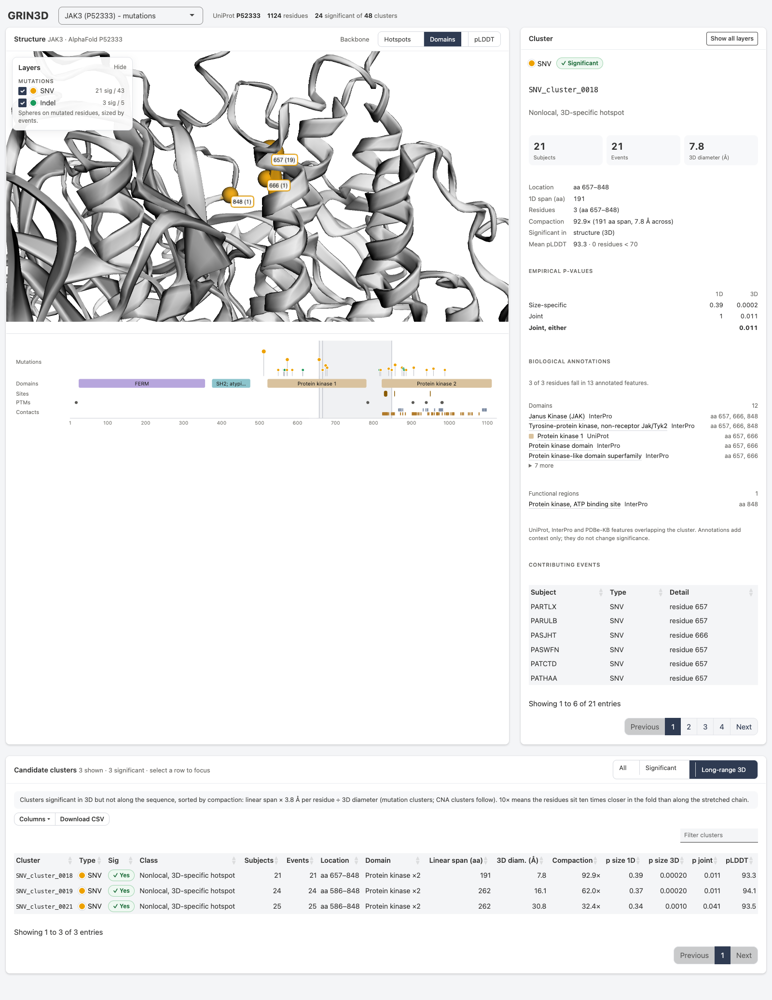

# GRIN3D structure viewer

This is an interactive Shiny + r3dmol viewer. It shows GRIN3D mutation hotspots and CNA exon hotspots on the same AlphaFold structure. Pick a protein from the searchable **Protein** box; type a gene symbol or UniProt ID to filter the list.

| Protein | UniProt | SNVs | Indels | CNAs |
|---|---|---|---|---|
| PTEN | P60484 | yes | yes | yes |
| CDKN2A | P42771 | — | — | yes |
| TP53 | P04637 | yes | yes | — |
| FBXW7 | Q969H0 | yes | yes | — |
| JAK3 | P52333 | yes | yes | — |
| IL7R | P16871 | yes | yes | — |
| LEF1 | Q9UJU2 | yes | yes | yes |

The sidebar lists only the alteration types a protein has. PTEN has no amplifications, so it gets no amplification row, and CDKN2A has no mutation section.



## Run

Run these from the repository root:

```r
install.packages(c("shiny", "r3dmol", "DT", "readxl"))   # once

# 1. SNV and indel hotspots (separate GRIN3D runs) for PTEN, TP53, FBXW7, JAK3 and IL7R from
#    datasets/T_ALL_public_data -> examples/<GENE>_mutations/results_{SNV,INDEL}/
#    Default is 1,000 simulations (minutes). The PTEN, TP53, FBXW7, JAK3 and IL7R
#    results in examples/ were run with 10,000 (LEF1 with 1,000):
#      Rscript visualization/prepare_mutation_examples.R <GENE> <SNV|INDEL> 10000
#    One gene/type at a time: Rscript visualization/prepare_mutation_examples.R PTEN INDEL
system("Rscript visualization/prepare_mutation_examples.R")

# 2. Convert every protein's GRIN3D results into the viewer input format, then
#    annotate every cluster with development-code/GRIN3D_annotate_protein_clusters.R
#    (UniProt, InterPro, PDBe-KB, ChEMBL; needs internet on first run, then cached)
#    -> visualization/data/<PROTEIN>_viewer_{clusters,residues,members}.csv + proteins.csv
#    -> visualization/data/annotations/<PROTEIN>/
system("Rscript visualization/grin3d_viewer_input.R")

# 3. Open the viewer
shiny::runApp("visualization")
```

The CSVs in `visualization/data/` are already built, so you can skip straight to step 3.

## What the viewer shows

Colors follow what each alteration means. Copy number is a diverging scale: blue is loss, rose is gain, and the darker step means more copies changed. SNVs (amber) and indels (green) use hues outside that scale and are drawn as a different mark (spheres, not backbone). The six colors pass the dataviz palette validator on every pair, including simulated color-vision deficiency. The worst pair scores ΔE 8.6 under simulated color-vision deficiency and 16.5 with normal vision. SNV and indel share a mark, so they were checked separately: ΔE 11 under simulated color-vision deficiency.

| Layer | Color | How it is drawn |
|---|---|---|
| SNV | `#EDA100` amber | A sphere on the C-alpha atom of each mutated residue, sized by the number of events |
| Indel | `#1A9A5C` green | Same as SNV. A residue with both SNVs and indels takes the color of the type with more events; the sphere is sized by events of both types. |
| Homozygous deletion (HOMDEL) | `#184F95` dark blue | Backbone of exons in significant hotspot clusters |
| Heterozygous deletion (HETDEL) | `#6DA7EC` light blue | Same as HOMDEL |
| Gain (GAIN) | `#EF8AA0` light rose | Same as HOMDEL |
| Amplification (AMP) | `#B3264A` dark rose | Same as HOMDEL |
| Pooled CNAs (ALL_CNA) | `#5B5A56` slate | Listed in the table; drawn only when one of its clusters is selected |

## Layout

- **Header:** the `GRIN3D` wordmark, a searchable **protein** picker, and a one-line summary (UniProt ID, residues, significant clusters).
- **Structure panel:** the 3D model.
  - **Layers legend:** a collapsible panel floating on the viewer. It doubles as the layer toggles.
    - Each row shows a swatch shaped like its mark (a dot for mutations, a bar for CNAs) and the cluster count as `significant / total`.
    - Only the alteration types the protein has are listed.
    - The copy-number rows sit under a loss-to-gain strip, in the same order as the strip.
    - **All altered exons** colors every altered exon, not only the exons in significant hotspot clusters.
  - **Backbone** (toolbar switch) chooses how the backbone is colored:
    - **Hotspots** colors CNA hotspot exons.
    - **Domains** colors annotated domains in the same colors as the feature map, each inside a labeled translucent envelope.
    - **pLDDT** colors AlphaFold confidence bands.

    Mutation spheres are drawn in every mode.
  - **Feature map** (below the model) shows the protein's sequence from start to end, with one row each for:
    - mutation lollipops;
    - exons (CNA proteins only);
    - domains;
    - regions (motifs, disorder, topology);
    - curated sites;
    - PTMs;
    - PDBe-KB interface and ligand contacts.

    Hover over any mark for its details. The selected cluster is shaded across every row.
- **Biological annotations** (its own card under the feature map): a sortable, filterable table of the UniProt, InterPro and PDBe-KB features, each linked to its source record.
  - **Cluster selected:** the features overlapping it, with the overlapping residues. Sites, interactions and functional regions come before domains, which repeat the same region across InterPro entries.
  - **Nothing selected:** every annotated feature on the protein, in sequence order.
  - For CNA clusters, the overlap is computed on the residues encoded by the cluster's exons.
- **Cluster inspector (right):**
  - **Nothing selected:** the number of significant clusters per alteration type.
  - **Cluster selected:** the cluster's status, subjects, events, 3D diameter, location, pLDDT, empirical p-values, the other clusters and sites at its 3D site, and contributing events. For CNA clusters each event shows its coding fraction as a bar on a fixed 0–1 track (hover for the value).
  - **Nothing selected:** also shows the ChEMBL drugs that target the protein. This is protein-level evidence, not tied to any cluster.
- **Candidate clusters (below):** a sortable, filterable table. Click a row to focus the structure on that cluster.
  - **View switch:**
    - **All** lists every cluster.
    - **Significant** lists clusters that pass the joint test.
    - **Long-range 3D** lists clusters that are significant in 3D but not along the sequence (GRIN3D's "nonlocal, 3D-specific" hotspots), sorted by compaction.
    - **Convergent** lists 3D-significant clusters that share their site with significant clusters of other alteration types (long-range 3D first). For PTEN the top rows are:
      - `HOMDEL_cluster_0001`: exons 1, 2 and 5, with HETDEL on the same exons, the R130 SNV cluster and the active-site/ligand pocket, in the phosphatase domain.
      - `INDEL_cluster_0033`: residues 195, 246 and 247 (5.3 Å across), with the SNV clusters at 243–249, in the C2 domain.
  - **Columns:**
    - **Domain** lists the annotated domains the cluster overlaps. Repeats are collapsed, e.g. `WD ×2`.
    - **Also at site** lists the other significant alteration types at the cluster's 3D site (see below).
    - **Linear span** is the distance along the sequence (`residue_max - residue_min`).
    - **Compaction** is linear span × 3.8 Å per residue ÷ 3D diameter: how many times closer the residues sit in the fold than along a stretched chain. It applies to mutation clusters only. A CNA cluster's 3D diameter is an exon-to-exon proximity, so its compaction shows a dash.
    - **Columns** reveals the remaining `mutation_hotspot_clusters.csv` fields: 1D and 3D significance, joint and protein-wide p-values, tree 1D span, residue count, start and end residues, and trees.
  - **Download CSV** exports the rows currently shown.

When one residue is covered by more than one visible CNA type, the type with the most events sets its color.

Selecting a row in the cluster table does three things:

- It switches to a focus view of that cluster's 3D site on a pale backbone, drawn like the display example in `GRIND-Biohackathon-Meeting2.pdf`:
  - **the cluster:** mutated residues appear as clumps of atom spheres labeled `residue (events)`, and CNA clusters as their exons in alternating shades, each labeled;
  - **other alteration types at the same site**, in their own colors:
    - mutation clusters with residues within 8 Å (C-alpha); these get smaller spheres, and a residue hit by both types shows the selected color on its side chain and the other on its backbone;
    - CNA clusters whose exons contain the cluster, drawn as backbone;
    - for a CNA cluster, the clusters lying wholly inside its exons;
  - **the domain(s) it falls in**, as backbone in the feature-map colors, labeled with their residue range (no envelope here: the view zooms inside the domain, where a surface around the camera fogs the scene; the envelopes belong to the whole-protein **Domains** mode);
  - **functional sites nearby**, as a violet surface: curated active/binding sites and PDBe ligand contacts, plus interaction interfaces. Violet (`#8A5CD0`) passes the palette validator against all six alteration colors; cyan clashed with HETDEL.

  The structure header names the cluster and its exons, and the legend lists what is drawn. The view zooms to the functional site where the cluster has one (for a mutation cluster, the cluster stays in frame beside it), otherwise to the cluster. **Show all layers** returns to the full view. The combined site is descriptive: each member cluster is significant on its own, but the site as a whole is not a separate test.
- It shows the cluster's statistics: class, subjects, events, 1D/3D diameters, joint p-values, mean pLDDT, and the number of residues with pLDDT below 70.
- It lists the other clusters and functional sites at the same 3D site (**At this 3D site**), then the contributing subjects and events.
- It shows an **Export** button (Cluster panel header) that downloads `<PROTEIN>_<cluster>.zip` containing:
  - `<PROTEIN>_<cluster>.svg`: a figure with the current 3D view, a legend, the statistics, the other clusters and sites at the 3D site, and the feature map. The 3D view is WebGL, so it is embedded as a PNG snapshot of the view as you left it (rotation and zoom included); everything else is vector and editable in Illustrator or Inkscape.
  - `<PROTEIN>_<cluster>_stats.csv`: one row with every GRIN3D cluster column plus location, linear span, compaction, domains, co-located clusters, and nearby functional sites.

## Adding a protein

1. Run one or both GRIN3D modules for the protein.
2. Put its AlphaFold PDB file in the repository. `download_alphafold_pdb()` in `development-code/GRIN3D_prepare_protein_inputs.R` fetches it.
3. Add a call at the bottom of [grin3d_viewer_input.R](grin3d_viewer_input.R) and rerun that script:

   ```r
   build_viewer_input(
     protein = "NOTCH1", uniprot = "P46531",
     pdb_file = "examples/NOTCH1_CNA/input_files/AF-P46531-F1-model_v6.pdb",
     mutation_rds = NULL,   # or c(SNV = "<snv results RDS>", INDEL = "<indel results RDS>")
     cna_rds = "examples/NOTCH1_CNA/results/GRIN3D_exon_CNA_results.rds"
   )
   ```

The call writes the protein's three tables and adds the protein to `data/proteins.csv`. The app lists every protein in that file; no changes to `app.R` are needed.

## Biological annotations

Annotations come from Pramesh's module `development-code/GRIN3D_annotate_protein_clusters.R` (PR #1); see `docs/biological-annotation-workflow.md` on that branch.

`build_viewer_annotations()` in `grin3d_viewer_input.R` does the following for each protein:
1. Writes the combined cluster table: SNV, indel and CNA clusters, where each CNA cluster carries the residues its exons encode.
2. Calls `annotate_grin3d_clusters()` on that table.
3. Keeps the module's standard outputs in `data/annotations/<PROTEIN>/`. API responses are cached in its `raw/` folder.

The viewer reads three of those outputs: `protein_features.csv`, `cluster_feature_overlaps.csv` and `chembl_drug_mechanisms.csv`. [annotation_track.R](annotation_track.R) chooses which features appear on the feature map:
- **Domains:** UniProt's curated domains, repeats and transmembrane helices, plus InterPro domains only where UniProt has not already covered at least half the region.
- **Other rows:** everything else is drawn from the module's annotation classes.

PDBe-KB answers HTTP 404 when a protein has no interface or ligand records (e.g. CDKN2A ligands). The module treats that as an error, so the wrapper caches an empty response for those endpoints first.

## Input format

Any GRIN3D prototype can be displayed by writing these three tables. Their full definitions are at the top of [grin3d_viewer_input.R](grin3d_viewer_input.R).

| File | One row per | Key columns |
|---|---|---|
| `proteins.csv` | protein | `protein, uniprot, pdb_file, types`. `pdb_file` is relative to the repository root; `types` lists the alteration types present, separated by `;`. |
| `<PROTEIN>_viewer_clusters.csv` | cluster | `protein, source, alteration_type, cluster_id, hotspot_class, n_subjects, n_events, n_residues, diameter_1d, diameter_3d, p_1d_size, p_3d_size, p_1d_joint, p_3d_joint, p_any_joint, significant_any, mean_plddt, exons` |
| `<PROTEIN>_viewer_residues.csv` | residue × alteration type × cluster | `protein, residue, alteration_type, cluster_id, exon_order, n_events, n_subjects, plddt` |
| `<PROTEIN>_viewer_members.csv` | cluster × contributing event | `cluster_id, alteration_type, event_id, subject_id, event_type, detail, coding_fraction` |

`alteration_type` is one of `SNV, INDEL, HOMDEL, HETDEL, GAIN, AMP, ALL_CNA`. It can also be `MUT`, for mutation results that were not split into SNVs and indels.

`coding_fraction` is the share of a CNA event's coding bases that fall inside the cluster's exons. It is `NA` for mutation events, and the cluster panel draws it as a bar on a fixed 0–1 track rather than a number, so events compare at a glance.

In `<PROTEIN>_viewer_residues.csv`, a row with `cluster_id = NA` is a background count, meaning all events at that residue or exon. Rows that name a cluster link that cluster to its residues. CNA exons are expanded to residues using `exon_residue_mapping` from the CNA results.

The two converters are:

- `standardize_mutation_results(res, type)`, for the output of `run_grin3d_mutation_hotspots()`. Call it once per mutation type.
- `standardize_cna_results()`, for the output of `run_grin3d_exon_cna_hotspots()`.

`build_viewer_input()` combines whichever results exist for a protein, adds pLDDT from the PDB file's B-factor column, checks the tables, and updates `proteins.csv`.
